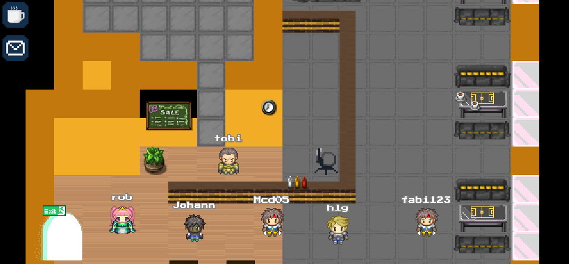
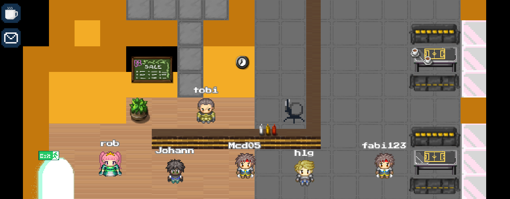
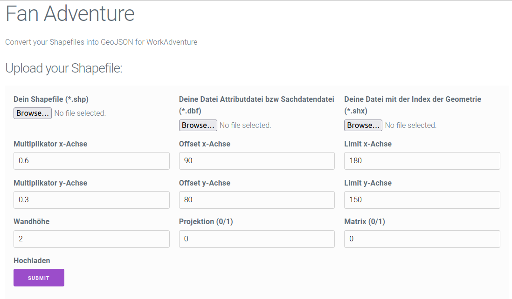

% FanAdventure
% Team Entity

Team Entity
========

<!--
\columnsbegin

\column{.3\textwidth}

\column{.7\textwidth}

\columnsend
-->

Fabian, Helga, Johann, Marco, Robert, Tobias

<!--
Team
Namen der Beteiligten
Challenge
Lösung
Screenshots
Ausblick
technologischer Einblick (Architekturstack, Algorithmik)
-->

Wildcard Challenge
=====================

Wir schaffen eine __virtuelle Vereinsheimat__, damit sich Fans jederzeit im Station oder rundherum treffen und austauschen können:  jeden Tag und zu jeder Zeit, vor dem Spiel, nach dem Spiel, nicht nur an Spieltagen und auch unter Pandemiebedingungen ...

Demo
=========

<https://play.workadventu.re/_/global/dungeon.heep.sax.de/entitiy/testfiles/shp/overviewMap.json>

Pipeline und Tools
=======

* dwg $\rightarrow$ shp (FME)
* dwg $\rightarrow$ dxf (Oda Converter)
* dxf Verbesserung (LibreCAD)
* dxf $\rightarrow$ shp (GDAL OGR2OGR)
* shp $\rightarrow$ matrix $\rightarrow$ TMX JSON (Python)
* Tile Set pixeln (Krita)
* manuelle Nachbearbeitung (Tiled)

Service
==========

<https://dungeon.heep.sax.de/entitiy/www_data/>

Links
=========

* Play: <https://play.workadventu.re/_/global/dungeon.heep.sax.de/entitiy/testfiles/shp/overviewMap.json>
* Source: <https://github.com/tobiaskeiner/entitiy>
* Service: <https://dungeon.heep.sax.de/entitiy/www_data/>

